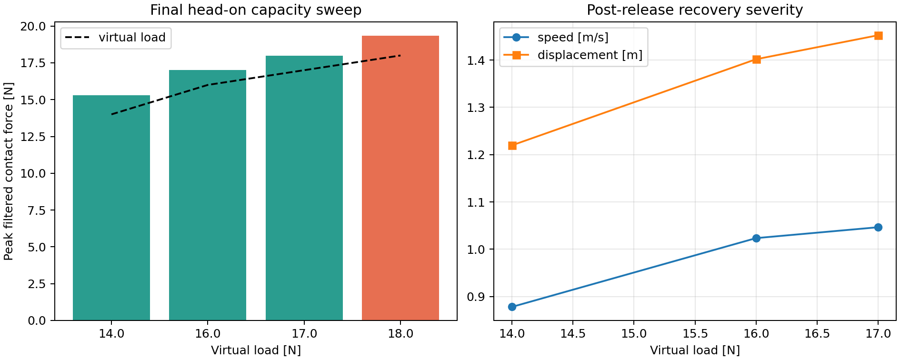

# HNUTER closed-loop IEBC 兼容性与接触力调试记录

日期：2026-08-16

## 结论

### 2026-08-16 定时撤载 IEBC 主动限功率复验

按新的目标完成了 54 N、推压 85 s 后定时撤载的三组对照。80 J 主动组在
撤载前连续介入约 12.34 s，最大能量 79.756 J、最小物理 barrier 0.244 J、
QP slack 为 0；撤载后只冻结环境储能，IEBC 本体及参考滤波保持运行。

相对 200 J 高预算组，80 J 组将撤载峰值速度从 3.537 m/s 降到
3.273 m/s（约 7.47%），但最大位移没有降低（4.122 m 对 4.131 m）。
Nominal 组在撤载前因 7.426° 航向越界被安全终止，因此不能作为完整撤载基线。
严格结论、TRO 风格图和原始证据映射见
[定时撤载验证报告](evidence/timed_release_iebc_validation_20260816.md)、
[PDF](evidence/timed_release_iebc_comparison_20260816.pdf) 和
[600 dpi PNG](evidence/timed_release_iebc_comparison_20260816.png)。

- 新的 `closed_loop` 方法已经接入独立的 Gazebo 接触实验入口，旧控制器和旧实验脚本已按原始字节备份。
- 2026-08-16 最新场景已改为 **0.05 kg 轻质门体代理**。恒定虚拟阻力在接近前预加载，避免轻物体在无人机建立接触前被推走。
- 成功判据已从“物体位移超过 20 mm”改为“低通接触力连续 0.04 s 达到虚拟阻力阈值”；阈值一旦满足就立即撤销虚拟力。物体位移只记录释放后的响应，不参与 PASS/FAIL。
- 新判据下 10、20、30、40、50 N 均完成；54 N 两次完成；54.5 N 在保持正对的条件下稳定停在约 54.4 N、直至超时。因此当前单次仿真边界为 **`[54.0, 54.5) N`**，与 `4.5 kg * 12 m/s^2 = 54 N` 的位置环水平加速度限幅相符。
- 但两次 54 N 的阈值穿越都包含 Gazebo 接触求解器单周期约 107.75 N 尖峰，随后低通量越过阈值；所以 54 N 只能称为“按当前数字判据重复通过”，不能称为严格准静态持续力。50 N 是本次明确完成的整数裕量点，也不能直接外推到实机。
- 释放冲击随载荷显著增大：50 N 后整机峰值速度 3.23 m/s，54 N 后约 3.55--3.59 m/s。这里验证的是推力/脱扣能力，不代表释放过程安全。



完整数值见 [force_sweep_summary.csv](evidence/force_sweep_summary.csv)。

最新力触发扫描的完整数值和原始证据映射见
[force_threshold_sweep_20260816.csv](evidence/force_threshold_sweep_20260816.csv)。

最新一次带 Gazebo GUI 的 54 N 复验同样完成，触发时滤波力为
55.414 N，加载阶段最大航向误差 2.543°，QP slack 为 0，最小 IEBC
barrier 为 104.026 J。释放后峰值速度达到 3.579 m/s，因此该结果证明当前
判据下的接触/撤力流程可完成，但不证明释放过程安全。完整记录与 TRO 风格曲线见
[54 N 复验记录](evidence/force_threshold_54n_run_1786874862.md)、
[PDF](evidence/force_threshold_54n_run_1786874862.pdf) 和
[600 dpi PNG](evidence/force_threshold_54n_run_1786874862.png)。

## 2026-08-16 最新轻质门体与力触发判据

### 场景和顺序

1. `interaction_cube` 质量由 1.0 kg 降为 0.05 kg，转动惯量同比缩放，滑轨阻尼由 0.20 降为 0.02；它只模拟被推开的轻门体，不再用惯性位移证明推力。
2. 圆柱接触杆仍为 0.5 m、0.01 kg，杆尖距机体原点约 0.75 m。
3. 起飞/接近前先对门体施加世界 `-X` 恒力，使其压在滑轨下限；无人机完成偏航对准后沿 `+X` 接近。
4. 接触后以 0.05 m/s 增加前向位置参考，最大推进 4.5 m、最长 110 s。
5. 低通后的接触 X 向力连续达到虚拟阻力 0.04 s 后立即清除恒力、冻结当时参考并观察 7 s。`cube_world_x` 仅用于显示清除后的门体响应。
6. 接触全过程保留 5°/0.25 s 物理偏航门限、IEBC barrier 门限和 QP 不可行门限。

恒力必须在接近前预加载。最初一轮 10 N 测试仍按旧顺序在接触后才施力；0.05 kg 门体已经被接触杆推离初始位置，故该轮无效且不列入最终扫描。

### 完整扫描

能力扫描显式提高 `Emax`，使闭环能量证书上限高于对应测试载荷；所有最终运行的 QP slack 均为 0，barrier 均保持为正。

| 阻力 | Emax | 结果 | 释放/失败证据 | 推压航向峰值 | 释放后整机峰值速度 |
|---:|---:|---|---|---:|---:|
| 10 N | 10 J | PASS | 滤波力 10.16 N 达阈值 | 1.84° | 0.63 m/s |
| 20 N | 30 J | PASS | 滤波力 21.81 N 达阈值 | 1.36° | 1.33 m/s |
| 30 N | 60 J | PASS | 滤波力 30.79 N 达阈值 | 2.83° | 1.96 m/s |
| 40 N | 110 J | PASS | 滤波力 40.08 N 达阈值 | 1.58° | 2.58 m/s |
| 50 N | 170 J | PASS | 滤波力 50.07 N 达阈值 | 1.89° | 3.23 m/s |
| 54 N A | 200 J | PASS | 滤波力 55.41 N；含单周期接触尖峰 | 1.57° | 3.59 m/s |
| 54 N B | 200 J | PASS | 滤波力 55.12 N；含单周期接触尖峰 | 2.08° | 3.55 m/s |
| 54.5 N | 205 J | FAIL | 正对稳定至超时；滤波峰值 54.40 N | 2.15° | - |
| 55 N | 210 J | FAIL | 达阈值前偏航误差持续超过 5° | 6.83° | - |
| 56 N | 220 J | FAIL | 达阈值前偏航误差持续超过 5° | 6.52° | - |

54.5 N 是决定静态边界的关键失败样本：没有 IEBC 不可行、没有 barrier 越界、没有物体位移误判，也没有偏航越界；参考推进耗尽后接触力稳定在阈值以下。因此此前基于 0.8 m 推进和 20 mm 位移判据得到的约 18.1 N 不是飞行器推力极限，只是旧场景/旧判据的边界。

### 证据解释边界

- Gazebo 接触消息在若干脱扣时刻出现单周期倍增尖峰，例如 54 N 两次均约 107.75 N。0.08 s 一阶低通和 0.04 s 持续判据能过滤普通抖动，但大尖峰仍可通过其衰减尾部触发。因此报告同时保存 raw、filtered 和触发时刻，不能只看 PASS 标签。
- 当前 `wrench_source=proxy` 仍不是执行器实测 wrench。结果用于 SITL 功能/容量探索，不是论文级证书，也不是实机允许载荷。
- “门被推开多远”与成功无关；门体极轻，撤力后移动数米是预期响应。整机释放后的高速前冲是真实风险指标，后续应增加释放参考回撤或分级卸载后再做硬件试验。

## 仓库基线

| 仓库 | 分支 | 调试开始时 HEAD |
|---|---|---|
| PX4 | `codex/hnuter-pitch-tail-safety-20260808` | `a4b6ac29adff7846d4ef42d95f84023f5c96efcf` |
| 外部控制 | `hardware` | `21a692da35aac48f55da6ab1e1d141654ae2ca69` |

两个工作区开始时均已有用户未提交修改。本次没有提交、推送或覆盖这些修改。

## 发现并修复的问题

### 1. Gazebo 航向读错对象

旧实验用 `name.startswith("hnuter_contact_")` 选择 `/pose/info`，会同时匹配整机模型和 `::contact_probe` 等子链接。接触杆相对机体有固定 90 度旋转，使用其欧拉角会产生虚假航向漂移。现在只接受不含 `::` 的整机模型姿态，并增加了回归测试。

### 2. PX4 局部航向与 Gazebo 世界航向不能使用固定偏置

固定 `HNUTER_CUBE_YAW_CMD_BIAS_DEG=-3.5` 会受每次 EKF 局部航向初始化影响；接触产生 Roll/Pitch 后，两种欧拉角表示也不再是严格常量偏置。现在：

1. `ALIGN_YAW` 阶段自动建立 PX4 控制航向到 Gazebo 世界航向的映射；
2. APPROACH、LOAD_SETTLE 和 PUSH 阶段继续使用慢速世界航向外环保持杆轴正对物体；
3. 仍保留物理航向误差 5 度、持续 0.25 s 即失败的独立几何门限。

### 3. 接触杆产生偏航“倒立摆”负刚度

原 1 m 接触杆的杆尖距机体原点约 1.25 m。机头承受压缩接触力时，小偏航会产生同向放大的力矩，等效负刚度近似为 `F*l N m/rad`。因此原模型在 7 N 时已产生约 8.75 N m/rad 的负刚度，通用 SITL 参数 `HNTR_ATT_KR_Y=3.2` 明显不足。

2026-08-16 的最终修订把圆柱杆从 1.0 m 缩短到 0.5 m，杆尖距机体原点约 0.75 m；质量仍为 0.01 kg，并按新几何重新计算惯量。接触专用 4054 模型使用 `HNTR_ATT_KR_Y=15`、`HNTR_ATT_D_Y=3.5`、`HNTR_ATT_I_Y=0`、`HNTR_TAU_Y=1.8`。在 17 N 时负刚度约 12.75 N m/rad，仍低于专用航向比例刚度并保留阻尼和力矩余量。该修改不影响通用 HNUTER SITL 或实机模型。

立方体质量由 2.0 kg 调为 1.0 kg，惯量同步按长方体公式更新。这只是接触实验对象的参数，不改变无人机模型质量。

### 4. 35 mm/s 不是稳定的准静态推进速度

10 N 在 35 mm/s 下两次因接触航向动态失败；同一目标力改为 20 mm/s 后完整成功。因此 closed-loop 场景默认推进速度改为 20 mm/s，最大推进时间同步从 25 s 增加到 45 s。目标力和最大推进距离没有缩小。

### 5. proxy 储能错误使用三轴运动

当前 proxy 只重建交互 X 轴的执行器力，旧实现却用完整 XYZ 动能、重力势能和三轴功率更新环境储能。横向/高度控制运动会被误记为环境输入功，造成虚假能量增长和提前限幅。proxy 模式现在只沿交互轴计算机械能与功率；external-wrench 模式仍保留完整三轴计算。

### 6. 参考速度 QP 的加速度约束过低

初始实验使用 0.8 m/s²，4 N 时已出现速率约束导致的 QP 不可行。场景默认改为 3.0 m/s²，并增加持续不可行/slack 失败判据，避免把无法满足的 QP 当作成功。

### 7. 运行入口和退出清理

`run_hnuter_iebc_cube_contact.sh` 现在显式支持：

- `HNUTER_IEBC_EXPERIMENT_VARIANT=closed_loop`（默认）；
- `HNUTER_IEBC_EXPERIMENT_VARIANT=legacy`（旧版本 A/B）；
- `HNUTER_GZ_HEADLESS=0` 启动 Gazebo 可视化界面（默认值 `1` 为无界面批量运行）；
- `HNUTER_GZ_KEEP_OPEN=1` 让可视化窗口在实验完成后继续保留；
- 退出时按 PX4/Gazebo 进程组执行 INT、短等待和 TERM，避免仿真结束后挂起。

## 闭环参数兼容性

PX4 4051/4054 的 XY 位置环关键参数为：

| 参数 | 值 | 对 closed-loop 模型的含义 |
|---|---:|---|
| `HNTR_MASS` | 4.5 kg | `mass=4.5` |
| `HNTR_POS_P_XY` | 1.0 s⁻¹ | 位置误差到速度期望 |
| `HNTR_VEL_P_XY` | 2.5 s⁻¹ | 速度误差到加速度 |
| `HNTR_VEL_I_XY` | 0.20 | 未包含在理想 Kc/Dc 中 |
| `HNTR_VEL_ILIM_XY` | 2.0 m/s² | 最多约 9 N 积分力 |
| `HNTR_VEL_D_XY` | 0.20 s | 未完整包含在 proxy 证书中 |
| `HNTR_ACC_XY` | 12 m/s² | 远高于本次静态载荷需求 |

理想级联 PD 的等效参数匹配正确：

- `Kc = m * VEL_P_XY * POS_P_XY = 4.5 * 2.5 * 1.0 = 11.25 N/m`；
- `Dc = m * VEL_P_XY = 11.25 N s/m`。

但 PX4 还存在速度积分、速度 D 项、加速度前馈和饱和/抗饱和逻辑。当前 `wrench_source=proxy` 无法精确重建这些内部项，所以本报告的高载荷结果是**功能与能力验证**，不是严格的论文级能量证书。定量认证需使用实测/仿真的 external actuator wrench，并辨识 `lambda_bar` 与非建模残差 `P_r_bar`；不能继续把残差固定为零后宣称完整证明。

## 最终测试配置

默认安全回归：

```text
virtual load             7 N
Emax                     2.5 J
Kc / Dc                  11.25 N/m / 11.25 N s/m
push rate                0.020 m/s
max push distance/time   0.80 m / 45 s
yaw physical gate        5 deg for 0.25 s
contact probe            0.5 m, 0.01 kg, tip x=0.75 m
cube mass                1.0 kg
contact-model yaw        KR=15, D=3.5, I=0, tau-limit=1.8
```

最终源码对应的 7 N / 2.5 J 默认回归已完整成功：释放后峰值速度
0.459 m/s、最大位置偏移 0.632 m。带 Gazebo GUI 的独立 7 N 回归同样完整成功：释放后峰值速度 0.468 m/s、最大位置偏移 0.632 m。

能力扫描只提高 `virtual load` 和 `Emax`，其余最终参数保持相同。最终边界：

| 载荷 | Emax | 结果 | 关键结果（2026-08-16 最终几何/参数） |
|---:|---:|---|---|
| 7 N | 2.5 J | 成功 | 峰值接触力 7.46 N；barrier 最小值 0.278 J；释放速度 0.459 m/s |
| 14 N | 12 J | 成功 | 峰值接触力 14.67 N；barrier 最小值 7.916 J；释放速度 0.925 m/s |
| 17 N | 16 J | 成功 | 峰值接触力 17.82 N；barrier 最小值 10.978 J；释放速度 1.070 m/s |

所有最终运行的 QP slack 均为 0，能量 barrier 保持为正。较早的长杆/高航向增益扫描中 16 N 成功、18 N 未通过的记录保留作为历史边界；由于接触杆长度、立方体质量和航向参数已经改变，不能把旧 18 N 失败直接当作当前配置的新边界。当前最终配置的最大复验载荷仍为 17 N，尚未重新尝试 18 N。

### 可视化和力方向复验

旧世界中的绿色 `force_direction_marker` 是静态装饰物，容易被误解为实时外力，而且箭头方向与立方体实际所受的 `-X` 虚拟阻力不一致。最终版本移除了静态物体，改由实验控制器只在恒力实际生效期间创建红色力矢量：箭身和锥头均指向飞机（世界 `-X`），长度按力值变化，撤力时立即删除。

使用下列配置启动 Gazebo GUI，验证了标记创建、完整接触、破静、撤力、标记清除和恢复过程：

```bash
HNUTER_GZ_HEADLESS=0 HNUTER_GZ_KEEP_OPEN=0 \
HNUTER_CUBE_FORCE_N=7.0 HNUTER_IEBC_E_MAX_J=2.5 \
HNUTER_IEBC_EXPERIMENT_VARIANT=closed_loop \
Tools/simulation/gz/run_hnuter_iebc_cube_contact.sh
```

控制器日志明确记录 `Gazebo publish=True, GUI marker=True`，撤力后记录标记清除。本次 GUI 回归的原始数据为 `hnuter_iebc_cube_contact_closed_loop_1786862220.csv`，PX4 ULog 为 `2026-08-16/06_36_59.ulg`。

最终 17 N 无界面复验仍成功：最大观测接触力 17.82 N，释放后峰值速度 1.070 m/s、最大整机位移 1.402 m，立方体总位移 3.978 m。原始数据为 `hnuter_iebc_cube_contact_closed_loop_1786861817.csv`，PX4 ULog 为 `2026-08-16/06_30_15.ulg`。所列证据的哈希均见 `SOURCE_MANIFEST.sha256`。

### 航向振荡修复效果

修订前一次未接触的 17 N GUI 运行中，接近阶段航向标准差为 2.466 度、峰值误差 5.456 度，并出现约 1.316 Hz 的左右摆动。缩短接触杆、降低世界航向外环增益并使用接触专用航向参数后，7 N 回归的接近阶段航向标准差降至 0.266 度、峰值 1.513 度，标准差约下降 89%；14 N 和 17 N 推压阶段的航向峰值分别为 0.851 度和 1.434 度，均未触发 5 度几何失败门限。

## 2026-08-16 可视化极限细化扫描

为区分 IEBC 能量上限与位置环可实现上限，本轮所有试验固定使用 `Emax=18 J`，只改变恒定虚拟阻力，并全程打开 Gazebo GUI。该能量预算对应的闭环静态证书上限为
`sqrt(2*Kc*Emax)=20.12 N`，高于本轮接触能力，因此 IEBC 不应成为先到达的限制。

按名义推进距离计算的位置环准静态估算为：

```text
F_P = m * VEL_P_XY * POS_P_XY * 0.80 = 9.0 N
F_I = m * VEL_ILIM_XY                  = 9.0 N
F_nominal = F_P + F_I                  = 18.0 N
```

实测中飞机会被接触反力向后推，实际参考误差可略大于 0.80 m，且存在速度 D 项和接触瞬态，所以 18 N 不是严格的绝对上限。采用 0.25 N 递增并在首个失败后继续二分，结果如下：

| 指令阻力 | 结果 | 决策时立方体位移 | 推压航向峰值 | 最小 barrier | 撤力后峰值速度 |
|---:|---|---:|---:|---:|---:|
| 17.25 N | 成功 | 21.93 mm | 1.690° | 13.521 J | 1.065 m/s |
| 17.50 N | 成功 | 24.36 mm | 1.642° | 12.546 J | 1.121 m/s |
| 17.75 N | 成功 | 21.28 mm | 1.488° | 11.992 J | 1.116 m/s |
| 18.00 N | 成功 | 22.46 mm | 1.915° | 12.485 J | 1.145 m/s |
| 18.25 N | 失败 | 13.16 mm | 1.413° | 11.527 J | - |
| 18.125 N | 失败 | 5.23 mm | 1.721° | 11.755 J | - |
| 18.0625 N | 成功 | 21.57 mm | 1.375° | 12.036 J | 1.118 m/s |
| 18.09375 N | 成功 | 22.36 mm | 1.732° | 11.769 J | 1.112 m/s |
| 18.109375 N | 失败 | 11.38 mm | 1.113° | 11.907 J | - |

本轮单次扫描将数值边界夹在 `[18.09375, 18.109375) N`。考虑 Gazebo 接触离散、启动状态微小差异以及 20 mm/0.1 s 判据，工程结论应写成：**当前场景的可实现仿真极限约 18.1 N，18.0 N 是本轮明确完整通过的整数载荷。** 不应把 18.09375 N 的小数位当成物理精度或实机额定值。

所有运行均保持 QP slack 为 0，最小 barrier 大于 11.5 J，推压阶段最大绝对航向误差小于 2 度。失败样本的原因均是到达 0.80 m 推进上限后没有满足持续破静判据，而不是 IEBC 不可行、能量耗尽或航向失稳。接触原始力的 35--46 N 单步尖峰没有形成持续位移，未被误判为成功。

完整数值与原始证据映射见 [force_limit_refinement_20260816.csv](evidence/force_limit_refinement_20260816.csv)。

## 为什么旧代码看起来能通过更大的力

旧结果不能直接作为新闭环方法的上限依据，主要有四类混杂：

1. 旧 actuator proxy 使用“上一周期安全加速度”估计执行器力，在堵转推压时会漏掉由持续位置误差和积分产生的真实力；
2. 部分旧高载荷运行从开始就没有启用 IEBC，只验证了位置控制器容量；
3. 部分运行没有满足正对物体的航向几何；
4. scoped-link 姿态选择错误会把接触杆姿态误当整机航向。

修复这些问题后，新的 17 N 成功结果才同时满足：closed-loop 代码运行、物理杆正对、恒力确实施加、立方体实际破静、力被撤销以及释放后响应被记录。

## 验证层级与风险

- 已验证：SDF/XML、Shell 静态检查；外部控制仓库完整单元测试 62 项；PX4 SITL 编译与启动；7/14/17 N Gazebo 接触、恒力、破静、撤力和恢复全流程；7 N GUI 力矢量创建/清除。
- 未验证：实机接触；external-wrench 定量证书；接触杆柔性/传感器噪声；17 N 释放的实机安全性。
- 17 N 是当前仿真场景的最大已验证载荷，不是实机允许值。
- 由于释放速度随载荷显著上升，下一步应加入力撤销渐变或能量释放管理，再讨论实机台架/系留验证。

## 旧代码备份与证据

- `source_backup/legacy/`：修改前的旧控制器、旧实验、旧 runner 和旧测试；
- `source_backup/user_closed_loop_input/`：用户交付的 closed-loop 原始文件；
- `SOURCE_MANIFEST.sha256`：备份、最终关键源码和所选 ULog 的 SHA-256；
- `evidence/force_sweep_summary.csv`：选定 A/B 与最终边界试验；
- `evidence/force_sweep_summary.png`：力扫描和释放恢复趋势；
- `analyze_force_sweep.py`：从原 CSV 重建表格和图。

本目录没有创建 Git 提交，也没有推送远程。

## 2026-08-17：40 N 撤载制动与精简判据

本轮不再把立方体位移作为成功依据，也没有叠加 HOLD 状态、速度阈值、
参考误差等重复成功条件。实验完成只使用一个结果判据：进入最终保持阶段后，
实际三维位置在连续 1 s 内变化不超过 0.05 m。能量屏障、制动距离屏障和
QP slack 仍作为安全越界条件与诊断量保留。

撤载后的控制逻辑改为：RECOVERY 期间参考点保持在接触/撤载位置；速度必须
连续 1.5 s 低于 0.05 m/s 才确认停稳；确认后仅将目标重置一次到测得的停止点，
随后固定，不回到撤载前累积的虚拟位置，也不继续追随测量位置漂移。

最终 40 N 无界面运行完整通过：

| 指标 | 结果 |
|---|---:|
| 滤波释放力 | 40.591 N |
| 撤载后峰值整机速度 | 1.306 m/s |
| 最大前向位移 | 0.966 m |
| HOLD 锁存时间 | 7.344 s |
| 位置收敛时间 | 10.544 s |
| 收敛窗口内三维位置变化 | 0.011 m / 1 s |
| 最终前向速度 | 0.0025 m/s |
| 最小能量屏障 | 30.508 J |
| 最小制动距离屏障 | 0.639 m |
| 最大 QP slack | 0 W |
| recovery rate 不可行次数 | 0 |

原始数据和 TRO 风格曲线为
`evidence/40n_release_recovery_1786900171.csv`、`.png` 和 `.pdf`。
该结论仍属于 Gazebo + actuator-wrench proxy 的软件仿真证据，不是实机接触
安全认证。
