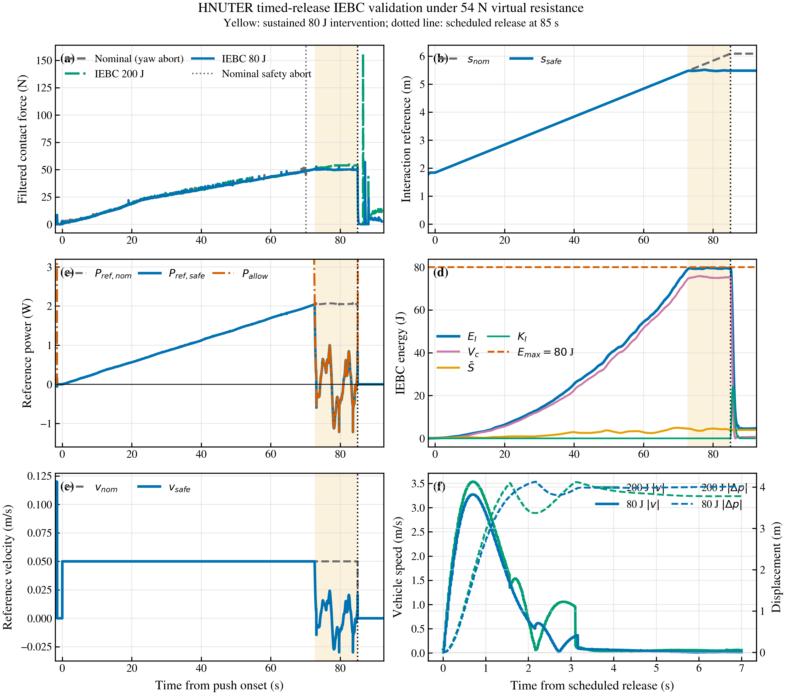

# 54 N 定时撤载 IEBC 闭环验证

日期：2026-08-16

## 验证目标

本轮不再用“是否顶到 54 N 并触发释放”评价 IEBC，而是在相同 54 N
虚拟阻力和相同 85 s 推压日程下检查：

1. 80 J 组能否在能量接近上界时主动降低参考功率；
2. 撤载时是否只冻结环境储能，而不关闭或重置 IEBC；
3. 主动限功率是否降低突然撤载后的瞬态速度和位移；
4. Nominal、200 J 高预算、80 J 主动组是否满足同一几何与安全门限。

## 实现修改

- 实验增加 `HNUTER_CUBE_RELEASE_MODE=time` 和
  `HNUTER_CUBE_RELEASE_TIME_S=85`。力阈值模式保留用于兼容旧实验。
- 定时点先撤销 Gazebo 虚拟阻力，再调用
  `freeze_environment_storage()`。冻结后仅停止环境储能积分；参考滤波、控制器
  储能、动能、总能量和屏障计算继续运行，没有调用 IEBC disable/reset。
- 增加 `nominal`、`iebc_high` 和 `iebc_active` 三个运行变体。高预算组固定
  `Emax=200 J`，主动组固定 `Emax=80 J`。
- 新增日志量：名义/安全参考位置、名义/安全参考功率、等效刚度力、Gazebo
  接触功率、储能更新使能、屏障介入持续时间和参考速度最大削减量。
- 主动组增加 0.5 J 数值收紧量；报告中的 `h=Emax-EI` 仍是物理屏障，收紧量
  只用于提前介入，避免离散实现越过 80 J。默认值仍为 0，不改变普通入口行为。
- PASS 同时要求：发生定时撤载、物理 `h >= -0.02 J`、slack 不超限、主动组
  出现持续参考削减、加载阶段绝对航向误差小于 5 度。

## 三组结果

| 组别 | 结果 | 最大航向误差 | 最大总能量 | 最小物理 h | 连续介入 | 撤载峰值速度 | 撤载最大位移 |
|---|---|---:|---:|---:|---:|---:|---:|
| Nominal | FAIL：70.12 s 时航向门限终止 | 7.426° | - | - | - | - | - |
| IEBC high，200 J | COMPLETE | 2.147° | 106.389 J | 93.611 J | 0.012 s | 3.537 m/s | 4.122 m |
| IEBC active，80 J | COMPLETE | 3.461° | 79.756 J | 0.244 J | 12.344 s | 3.273 m/s | 4.131 m |

三组完整数值和证据路径见
[`timed_release_iebc_summary_20260816.csv`](timed_release_iebc_summary_20260816.csv)。

矢量版本：[`timed_release_iebc_comparison_20260816.pdf`](timed_release_iebc_comparison_20260816.pdf)。

## 80 J 主动组约束核对

- 屏障最终一段连续介入约 12.35 s，日志累计介入量为 12.344 s；初始化时另有
  0.012 s 短脉冲，不计作有效限功率阶段。
- `E_I` 最大 79.756 J，物理 `h` 最小 0.244 J，最大 QP slack 为 0 W。
- 介入样本中 `P_ref,safe - P_allow` 最大值为 0 W，安全参考功率没有越过
  允许功率；安全参考速度相对名义参考最大削减 0.080 m/s。
- 撤载瞬间名义参考速度仍为 0.050 m/s，安全参考速度已降至 0.0203 m/s；
  名义/安全参考位置分别为 6.092/5.485 m。
- 撤载后 `iebc_storage_update_enabled=0`，环境储能保持 3.932843 J 不变，证明
  只冻结了环境储能。控制器储能和动能仍继续演化，IEBC 没有被关闭或清零。

## 严格结论

80 J 主动组证明了 IEBC 能在能量接近上界时持续降低参考功率，并在定时撤载后
将峰值速度相对 200 J 组从 3.5369 m/s 降到 3.2728 m/s，降幅约 **7.47%**。

但三维最大位移由 4.1219 m 变为 4.1308 m，增加约 **0.22%**，没有得到
“速度和位移都下降”的结果。这是因为当前保护主要降低撤载瞬间速度峰值，撤载后
仍保留较大的位置参考误差，后续位置环继续向前追踪；若要同时降低位移，需要增加
与安全参考连续衔接的撤载参考保持/回撤策略，不能用当前结果宣称已经解决。

Nominal 组在 85 s 撤载前因航向误差持续超过 5 度被安全终止。因此它是有效的
失败证据，却不是完整撤载基线；当前只能严格比较 200 J 与 80 J 两个完整运行。
后续应先复现一个不降低 5 度几何门限的 Nominal 完整基线，再做多次重复和统计，
不应删除或放宽航向安全门限来制造 PASS。

## 证据边界

- 当前仍使用 Gazebo `proxy` wrench；Gazebo 接触功率仅记录，不进入证书计算。
  本结果属于 SITL 功能验证，不是实机载荷认证，也不是论文级 external-wrench 证明。
- 轻质门体撤载后移动数米是场景预期，成功判据不使用门体位移。
- 80 J 组对应 PX4 ULog `12_16_19.ulg` 因按要求保持 Gazebo 打开仍在增长，
  本报告先固定已经关闭的控制器 CSV；关闭 Gazebo 后才能记录该 ULog 的最终哈希。

## 软件回归

- ROS 2 Jazzy 环境执行 `/usr/bin/python3 -m pytest -q tests`：69 passed，3 条
  protobuf/Python 3.14 弃用预告，不影响本轮结果。
- 运行入口通过 `bash -n`；控制器、实验状态机和绘图脚本通过 `py_compile`。
- 三个原始 CSV 均逐行检查字段数一致：Nominal/High 为 59 列，Active 在加入
  能量收紧量日志后为 61 列。

## 原始证据

- Nominal CSV：`hnuter_iebc_cube_contact_closed_loop_1786881573.csv`
- High 200 J CSV：`hnuter_iebc_cube_contact_closed_loop_1786881713.csv`
- Active 80 J CSV：`hnuter_iebc_cube_contact_closed_loop_1786882581.csv`
- Nominal ULog：`build/px4_sitl_default/rootfs/log/2026-08-16/11_59_31.ulg`
- High 200 J ULog：`build/px4_sitl_default/rootfs/log/2026-08-16/12_01_52.ulg`
- Active 80 J ULog（GUI 仍打开）：`build/px4_sitl_default/rootfs/log/2026-08-16/12_16_19.ulg`

哈希见上级目录的 `SOURCE_MANIFEST.sha256`。本轮没有提交或推送 Git。
