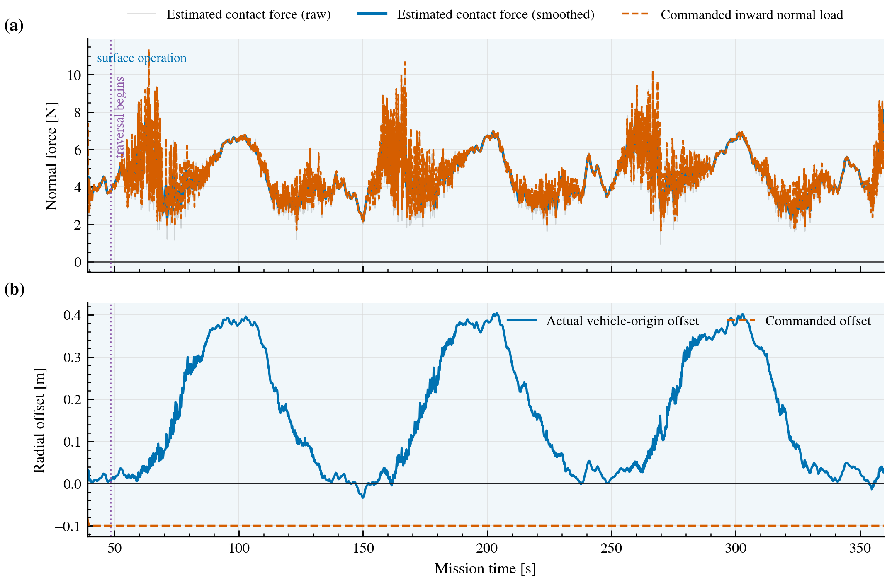
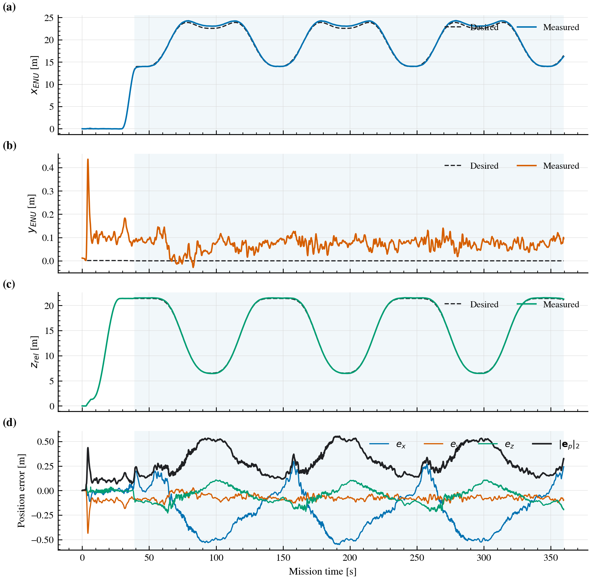
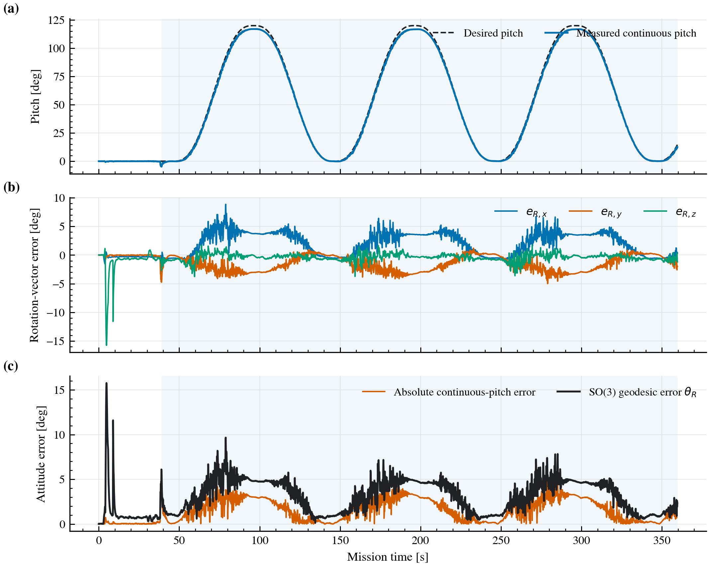

# Hnuter 球面贴附实验数据分析

## 数据

- 日志：`~/px4_ws_ros2/hnuter_sphere_direct_1782820934.csv`
- 时长：`359.56 s`
- 球面分析区间：`39.05-359.56 s`
- 球心：ENU `[14.0, 0.0, 11.5] m`
- 实体半径：`10.0 m`
- 期望轨迹半径：`9.9 m`

## 贴附力



日志没有 Gazebo 接触传感器的接触 wrench，因此图中的贴附力是基于刚体法向
动力学得到的估计值，而不是力传感器测量值：

```text
N_est = (F_thrust + F_gravity) . n_in - m (a . n_in)
```

其中控制器记录的机体系力先旋转到 ENU，速度经过均匀重采样和
Savitzky-Golay 微分后得到实际加速度。径向偏移以机体原点计算，不代表碰撞
网格接触点的间隙。

- 估计贴附力均值：`4.59 N`
- 标准差：`1.12 N`
- 5%-95% 分位：`3.02-6.59 N`

贴附力随球面往返运动呈周期变化，但表面阶段整体保持正值。机体原点位于实体
球面外约 `0-0.4 m`，与机体碰撞网格相对原点的几何偏置一致；期望原点位于
球内 `0.1 m`，持续产生法向预载。

## 位置跟踪



表面阶段位置指标：

| 指标 | 数值 |
| --- | ---: |
| `x` RMSE | `0.310 m` |
| `y` RMSE | `0.076 m` |
| `z` RMSE | `0.097 m` |
| 三维误差范数 RMSE | `0.333 m` |
| 三维误差范数 P95 | `0.524 m` |

`x` 方向误差主要是球内不可达期望点与实体接触约束共同形成的稳态预载误差，
不等价于自由飞行中的普通位置跟踪偏差。切向和高度方向的误差明显更小。

## 姿态跟踪



姿态误差使用旋转矩阵的 SO(3) 测地角计算，避免俯仰超过 `90 deg` 后欧拉角
表示分支切换造成虚假误差。

| 指标 | 数值 |
| --- | ---: |
| SO(3) 姿态误差 RMSE | `3.61 deg` |
| SO(3) 姿态误差 P95 | `5.39 deg` |
| 连续俯仰误差 MAE | `1.67 deg` |
| 连续俯仰误差 P95 | `3.41 deg` |

期望俯仰在 `0-120 deg` 间往返，实际连续俯仰最高约 `117 deg`。误差主要集中
在姿态变化较快的区间；峰值和回程附近保持稳定，没有出现 `90 deg` 欧拉角
奇异点导致的控制或绘图跳变。

## 输出文件

- `figure_1_attachment_force.pdf/png`
- `figure_2_position_tracking.pdf/png`
- `figure_3_attitude_tracking.pdf/png`
- `derived_metrics.csv`
- `analysis_summary.md`

所有文件位于 `docs/figures/hnuter_sphere_1782820934/`。PDF 为矢量格式，PNG
为 `300 dpi` 预览图。复现脚本为
`Tools/analysis/plot_hnuter_sphere_journal.py`。
