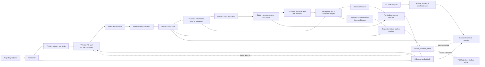
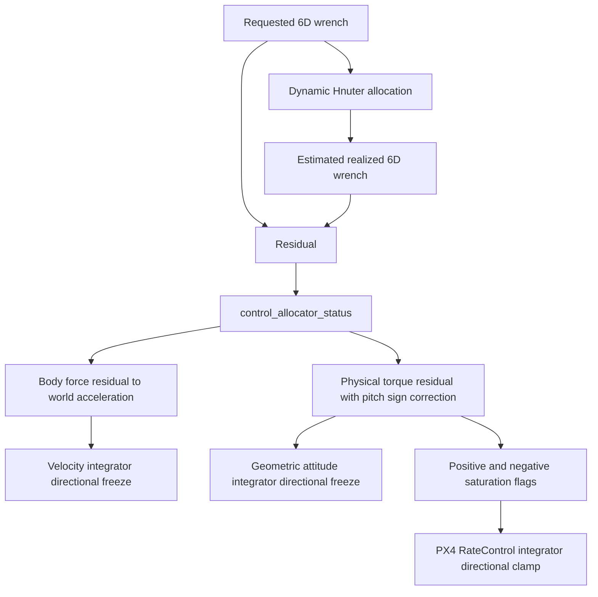

# Hnuter 倾转动态辨识与动态控制分配修复

日期：2026-07-18

## 1. 数据来源与合理性

实机动捕辨识数据位于 `analysis/`，采样率约 `99.6 Hz`。一级刚体相对机身的
主转轴解释度为 100%，二级刚体相对一级的主转轴解释度也为 100%，说明相对姿态
和铰链轴提取结果可信。

中等幅值（10--45 deg）双向阶跃的中位结果为：

| 机构 | 静态增益 K | 延迟 L | 时间常数 tau | 稳定段平均速度 |
|---|---:|---:|---:|---:|
| 一级正向 | 1.403 | 0.108 s | 0.070 s | 221 deg/s |
| 一级负向 | 1.425 | 0.103 s | 0.057 s | 168 deg/s |
| 二级正向 | 0.708 | 0.142 s | 0.125 s | 111 deg/s |
| 二级负向 | 0.712 | 0.129 s | 0.125 s | 96 deg/s |

二级扫频得到 `K=0.711, tau=0.068 s, L=0.067 s`，低频 coherence 接近 1。
扫频模型适合小信号，阶跃模型包含齿隙、负载和大动作时的附加滞后，因此飞行控制
默认采用更保守的阶跃参数。

报告中的单点最大角速度存在 300--1000 deg/s 尖峰，来自动捕姿态数值微分和阶跃
边沿，不可直接作为机构限速。固件使用稳定段平均速度的保守下界：一级 200 deg/s，
二级 100 deg/s。

二级的 `K` 约为 0.71，明显低于 1，与 1:2 齿轮传动及连杆/输出标定共同作用一致。
一级 `K` 约为 1.40。两者乘积接近 1，但这不代表可以忽略各级增益，因为两级控制
的是不同正交轴。

注意：二级试验的等效命令只覆盖到约 `+-90 deg`，实际输出约 `+-61.5 deg`。
当前模型在正常飞行小角度和已测试区间内可信，不能外推为物理二级一定能达到
`+-180 deg`。超出可实现范围后，allocator 会报告未分配控制量。

## 2. 新增参数

| 参数 | 功能 | 实机默认 | SITL 默认 |
|---|---|---:|---:|
| `HNTR_T1_GAIN` | 一级实际角/等效命令角 | 1.40 | 1.0 |
| `HNTR_T1_TAU` | 一级一阶时间常数 | 0.10 s | 0 |
| `HNTR_T1_DLY` | 一级纯延迟 | 0.11 s | 0 |
| `HNTR_T1_RATE` | 一级实际角速度上限 | 200 deg/s | 1000 deg/s |
| `HNTR_T2_GAIN` | 二级实际角/等效命令角 | 0.71 | 1.0 |
| `HNTR_T2_TAU` | 二级一阶时间常数 | 0.15 s | 0 |
| `HNTR_T2_DLY` | 二级纯延迟 | 0.15 s | 0 |
| `HNTR_T2_RATE` | 二级实际角速度上限 | 100 deg/s | 1000 deg/s |
| `HNTR_SYNC_ERR` | 姿态与倾转允许动态角差 | 5 deg | 45 deg |

参数均属于 QGC 的 `Hnuter Control` 分组，可在线修改。`GAIN` 是动捕测得的实际
关节角与等效舵机命令角之比，allocator 使用 `目标实际角 / GAIN` 生成舵机命令。

## 3. 控制分配修改

旧分配器先按目标倾角计算电机推力，最后以硬编码 `50 rad/s` 单独限制舵机命令。
这相当于电机认为倾转已瞬时到位，实机二级却仍在运动，滚转时会产生明显横向力。

新分配过程为：

1. 根据六维期望力/力矩求左右臂目标一级、二级物理角。
2. 使用静态增益的逆映射生成舵机命令并执行几何限幅。
3. 通过命令历史、纯延迟、一阶时间常数和最大角速度估计本周期实际可达角。
4. 用可达角构造左右臂当前推力单位向量。
5. 将期望三维臂力投影到可达方向，并限制在 `HNTR_MAX_ARM_T` 内。
6. 用投影后的推力生成 Motor1--4 命令。
7. 反算实际可实现的六维力/力矩，并写入 `control_allocator_status`。

该投影是当前执行器方向下的最小二乘最优解。它不会凭空消除物理机构滞后造成的
瞬时横向力，但避免电机幅值继续按尚未到达的倾角计算，并使上层控制器能够得知
真实控制缺口。

手动 Hnuter 姿态参考还增加了执行器同步约束。roll 参考按较慢的二级
`RATE` 和 `SYNC_ERR / (DLY + TAU)` 限制，pitch 参考按一级模型限制。实机默认
二级参数下，`HNTR_RC_RATE_R=20 deg/s` 会自动收紧到约 `16.7 deg/s`，使稳态
动态错位控制在约 5 deg；渐进回平使用相同约束。SITL 延迟和时间常数为零，不会
改变原有参考速率。

## 4. 抗积分饱和

- Hnuter 位置/速度环把上一周期未分配推力转换到世界坐标系。当速度误差继续要求
  执行器向不可实现方向增加输出时，暂停对应方向积分。
- 几何姿态积分使用未分配力矩做相同判断。
- PX4 `RateControl` 在 Hnuter 自定义早返回路径中也会收到正确的正/负饱和标志。
- pitch 在 Hnuter torque topic 中有一次符号变换，抗饱和反馈已转换回物理 pitch
  力矩方向。

## 5. 验证结果

- `make px4_sitl_default`：通过。
- `HEADLESS=1 make px4_sitl gz_hnuter`：启动成功。
- 自动起飞到 10 m、悬停和自动着陆成功。
- 悬停 roll 绝对值 95% 小于 0.31 deg，pitch 绝对值 95% 约 1.65 deg。
- 着陆前最终水平位置约 `[-0.086, -0.036] m`。
- 稳态 `control_allocator_status` 六维 residual 回到零附近。
- `make cuav_7-nano_default`：通过，Flash 95.12%，AXI SRAM 18.71%。
- 固件：`build/cuav_7-nano_default/cuav_7-nano_default.px4`。
- SHA-256：`64aaafaa3ffefb0b2d7a2990183d80c39220d2abdbec08e6697b663b5a0697bf`。

## 6. 实机验证顺序

烧录后先拆桨固定测试，确认新参数：

```sh
param show HNTR_T1_*
param show HNTR_T2_*
```

应看到实机 airframe 默认值。保持辨识时的 PWM 最小值、最大值、反向和机械零位，
因为改变舵机端点后 `GAIN` 必须重新辨识。

首次带桨测试按以下顺序进行：

1. 固定架小角度 roll/pitch，确认实际关节方向与 allocator 命令一致。
2. 观察 `listener control_allocator_status`；动作开始时允许短暂 residual，机构到位后
   应明显收敛。
3. Position 模式只做 `+-5 deg` roll，检查横向漂移和回中后的二次摆动。
4. 再逐步扩大到 `+-10 deg`、`+-15 deg`，不要直接测试 90/180 deg。
5. 若估计角明显领先实机，增大对应 `DLY/TAU` 或降低 `RATE`；若明显落后实机，
   反向小幅调整。

若需要临时恢复旧的近似瞬时模型，可设置：

```sh
param set HNTR_T1_GAIN 1.0
param set HNTR_T1_TAU 0.0
param set HNTR_T1_DLY 0.0
param set HNTR_T1_RATE 1000
param set HNTR_T2_GAIN 1.0
param set HNTR_T2_TAU 0.0
param set HNTR_T2_DLY 0.0
param set HNTR_T2_RATE 1000
param set HNTR_SYNC_ERR 45
param save
```

这只用于故障隔离，不建议作为实机飞行配置。

## 7. 2026-07-19 状态机与一级倾转物理零位修复

### 7.1 控制状态修复

- 所有消息新鲜度判断改用当前 `hrt_absolute_time()`。陀螺采样时间只保留为输出
  `timestamp_sample`，不再拿较旧的采样时刻判断 RC、里程计和 allocator 状态是否过期。
- Position 模式下 AUX 姿态目标只在真正退出手动平移控制模式或解除武装时重置。
  RC 数据短暂超过 500 ms 时停止继续积分角度和偏航，不清空已锁存的 roll、pitch、yaw
  目标；数据恢复后从原目标继续。
- 起飞保护不再从解锁时刻计时。只有 `landed=false` 且 `maybe_landed=false` 后才记录
  实际离地时刻和当时 XY 位置。
- 离地后的 `HNTR_TO_SUP_T` 秒内，机体系水平推力和允许倾角连续恢复；XY 速度积分在
  水平权限完全恢复前冻结，避免地面位置误差或执行器暂不可达量预先积累。
- `HNTR_TO_LOCK_T` 改为从实际离地时刻计时，在保护期内保持离地瞬间的 XY 位置。

### 7.2 共同前倾为什么表现为 X/Y 耦合

旧模型假定一级倾转归一化指令为 0 时实际角度也是 0。实机齿轮间隙和装配中位使
左右机臂在 PWM 中位都略向机体正 X 方向前倾。这是共同模式误差，即使左右机械
完全一致，也会产生约为 `F_horizontal = F_vertical * tan(alpha_zero)` 的持续机体系
前向力。该力经过当前 yaw 旋转到世界坐标后同时进入 X/Y；位置积分再缓慢生成反向
一级倾转补偿，所以会观察到方向偏斜、慢响应、改变航向后 X/Y 串扰方向变化，以及
一级倾转隔一段时间修正一次。

新增 `HNTR_T1_ZERO`，单位 deg，定义为舵机归一化指令为 0 时的实际一级关节角：

```text
actual_angle = HNTR_T1_ZERO + HNTR_T1_GAIN * equivalent_servo_angle
equivalent_servo_angle = (desired_angle - HNTR_T1_ZERO) / HNTR_T1_GAIN
```

逆分配、执行器延迟/一阶模型和实际推力方向投影都使用同一关系。左右机臂共用该参数，
符合当前机械近似一致的情况。SITL 和实机默认均为 0 deg，必须先在拆桨固定架上确认
符号后再写入。最近日志中悬停一级共同命令约为 `-0.023`，结合 185 deg 行程和
`HNTR_T1_GAIN=1.4` 粗略对应约 `-6 deg` 的物理补偿，因此共同前倾可能约为 `+6 deg`；
这只能作为从 `+2 deg` 开始逐步标定的方向提示，不能直接当作飞行值。

齿隙还会造成同一 PWM 从正、反方向接近时对应不同角度。一个静态 `T1_ZERO` 只能
消除平均零偏，不能消除方向相关回差。优先机械消隙、预紧齿轮或调整舵盘中位；若仍有
明显回差，应分别做正向和反向小幅扫频，得到死区宽度后再增加带状态的 play/backlash
模型。没有关节位置反馈时直接增加方向跳变补偿容易在零点附近来回切换，不应先用于飞行。

### 7.3 7-Nano 实机参数

airframe 的保守新默认值为：

```sh
HNTR_VEL_I_XY=0.15
HNTR_VEL_ILIM_XY=0.5
HNTR_T1_ZERO=0.0
```

`param set-default` 不会覆盖飞控中已经保存的旧值。烧录后应检查并显式迁移：

```sh
param set HNTR_VEL_I_XY 0.15
param set HNTR_VEL_ILIM_XY 0.5
# 拆桨固定架标定后再设置，例如从绝对值 2 deg 开始验证符号
param set HNTR_T1_ZERO 2.0
param save
```

若设置正值后机臂离水平更远，立即改回 0 并反向小步调整。不要用增大 XY 积分来代替
机械零位标定，否则航向改变时共同前倾力仍会以不同世界坐标分量重新出现。

SITL 地面在线测试中临时设置 `HNTR_T1_ZERO=10 deg`，左右一级舵机输出分别变为
`-0.05425/-0.05386`，与 `-10/185=-0.05405` 的理论预置一致；随后已恢复为 0。

## 8. 实现文件和调用关系

这部分代码没有建立一个独立 PX4 模块，而是分布在 Hnuter 控制器、Hnuter 执行器
有效性模型和 PX4 通用控制分配状态发布链中：

| 文件 | 责任 |
|---|---|
| `src/modules/control_allocator/VehicleActuatorEffectiveness/ActuatorEffectivenessHnuter.cpp` | 六维期望量逆解、倾转状态估计、当前方向投影、电机/舵机输出、六维残差反算 |
| `src/modules/control_allocator/VehicleActuatorEffectiveness/ActuatorEffectivenessHnuter.hpp` | 96 点命令历史、四个倾转估计状态、动态参数和残差状态 |
| `src/modules/control_allocator/ControlAllocator.cpp` | 调用 Hnuter 自定义残差接口，生成 `control_allocator_status` 的 achieved 标志和执行器饱和标志 |
| `src/modules/mc_rate_control/HnuterControl.cpp` | 级联位置/速度控制、几何姿态控制、残差抗积分饱和、手动姿态参考同步限速 |
| `src/lib/rate_control/rate_control.cpp` | PX4 RateControl 根据正/负饱和方向抑制角速度积分 |
| `src/modules/mc_rate_control/hnuter_control_params.c` | QGC 参数定义、单位、范围和参数分组 |
| `ROMFS/px4fmu_common/init.d/airframes/4051_gz_hnuter` | 7 Nano 实机默认辨识参数 |
| `ROMFS/px4fmu_common/init.d-posix/airframes/4051_gz_hnuter` | Gazebo SITL 近似瞬时执行器参数 |

`HnuterControl` 先发布归一化的 `vehicle_thrust_setpoint` 和
`vehicle_torque_setpoint`。Control Allocator 将二者组成六维期望量，调用
`ActuatorEffectivenessHnuter::updateSetpoint()`。Hnuter allocator 生成电机、舵机
命令后，将按估计倾角反算出的控制缺口保存在 `_unallocated_control`，下一周期通过
`control_allocator_status` 返回给控制器。

这是一个有一周期反馈延迟的闭环残差通道，不是代数环。

## 9. 倾转状态估计器

### 9.1 四个状态与实际机构的对应

四个倾转状态按 PX4 舵机功能顺序保存：

| 状态下标 | 舵机输出 | 物理量 | 参与的机臂方向 |
|---:|---:|---|---|
| 0 | Servo 1 | `alpha2`，右臂一级倾转 | 机体系 X/Z 平面 |
| 1 | Servo 2 | `alpha1`，左臂一级倾转 | 机体系 X/Z 平面 |
| 2 | Servo 3 | `theta2`，右臂二级倾转 | 机体系 Y 方向 |
| 3 | Servo 4 | `theta1`，左臂二级倾转 | 机体系 Y 方向 |

`resetTiltDynamics()` 在解除武装时清空历史和残差。一级状态初始化为
`HNTR_T1_ZERO`，二级初始化为 0：

```cpp
_estimated_tilt_angle.setZero();
_estimated_tilt_angle(0) = _tilt1_zero;
_estimated_tilt_angle(1) = _tilt1_zero;
_tilt_command_history_head = -1;
_tilt_command_history_count = 0;
_unallocated_control.setZero();
```

这里的状态是开环估计角，不是编码器测量角。当前实现没有关节位置传感器反馈。

### 9.2 纯延迟

命令历史每 5 ms 最多写入一次，环形缓冲区长度为 96，因此可覆盖约 480 ms，略大于
参数允许的最大 `DLY=0.4 s`：

```cpp
static constexpr hrt_abstime history_interval_us = 5000;

if (_tilt_command_history_count == 0
    || now - _last_tilt_history_sample >= history_interval_us) {
    _tilt_command_history_head =
        (_tilt_command_history_head + 1) % TILT_COMMAND_HISTORY_LENGTH;
    _tilt_command_history[_tilt_command_history_head].timestamp = now;
    _tilt_command_history[_tilt_command_history_head].command_angle = command_angle;
}
```

对每个状态，读取时间戳不晚于 `now - DLY` 的最新历史值：

```cpp
const float delay_s = axis < 2 ? _tilt1_delay_s : _tilt2_delay_s;
const hrt_abstime target_time = now > delay_us ? now - delay_us : 0;

if (_tilt_command_history[index].timestamp <= target_time) {
    selected_index = index;
    break;
}
```

当前是零阶保持纯延迟，没有在相邻历史点之间插值。5 ms 量化相对于实机
`110-150 ms` 延迟足够小。

### 9.3 静态增益、零位、一阶惯性和速度限制

对第 `i` 个关节，连续模型为：

```text
q_target(t) = q_zero + K * q_command(t - L)
tau * d(q_hat)/dt + q_hat = q_target
|d(q_hat)/dt| <= omega_max
```

其中：

- `q_command` 是由归一化舵机输出换算出的等效舵机命令角；
- `L` 是 `HNTR_T1_DLY` 或 `HNTR_T2_DLY`；
- `K` 是 `HNTR_T1_GAIN` 或 `HNTR_T2_GAIN`；
- `tau` 是对应的 `TAU`；
- `omega_max` 是对应的 `RATE`；
- `q_zero` 当前只对一级使用 `HNTR_T1_ZERO`，二级仍固定为 0。

一阶环节使用零阶保持输入下的精确离散形式，而不是简单 Euler 积分：

```text
delta_lag = (q_target - q_hat) * (1 - exp(-dt / tau))
delta = clamp(delta_lag, -omega_max * dt, +omega_max * dt)
q_hat(k+1) = q_hat(k) + delta
```

对应代码：

```cpp
const float gain = axis < 2 ? _tilt1_gain : _tilt2_gain;
const float tau_s = axis < 2 ? _tilt1_tau_s : _tilt2_tau_s;
const float rate_rad_s = axis < 2 ? _tilt1_rate_rad_s : _tilt2_rate_rad_s;
const float zero_angle = axis < 2 ? _tilt1_zero : 0.f;
const float target_angle = zero_angle + gain * delayed_command(axis);
const float error = target_angle - _estimated_tilt_angle(axis);
float delta = tau_s > 1e-4f
              ? error * (1.f - expf(-dt / tau_s)) : error;
const float max_delta = rate_rad_s * dt;
delta = math::constrain(delta, -max_delta, max_delta);
_estimated_tilt_angle(axis) += delta;
```

`dt` 在 allocator 中限制到 `0...0.05 s`，避免调度暂停后单周期状态跳变过大。

### 9.4 从目标物理角反算舵机命令

一级加入静态零位后使用：

```text
q_command = (q_desired - q_zero) / K
```

二级当前使用：

```text
q_command = q_desired / K
```

对应代码：

```cpp
servo_sp(0) = tiltAngleToNormalizedServo(
    (alpha2 - _tilt1_zero) / _tilt1_gain, _tilts, 0, radians(185.f));
servo_sp(1) = tiltAngleToNormalizedServo(
    (alpha1 - _tilt1_zero) / _tilt1_gain, _tilts, 1, radians(185.f));
servo_sp(2) = tiltAngleToNormalizedServo(
    theta2 / _tilt2_gain, _tilts, 2, radians(180.f));
servo_sp(3) = tiltAngleToNormalizedServo(
    theta1 / _tilt2_gain, _tilts, 3, radians(180.f));
```

`tiltAngleToNormalizedServo()` 分别使用 QGC 中配置的正角和负角范围，不假设两侧
机械行程绝对对称。

## 10. 当前倾角下的推力投影

### 10.1 从六维期望量得到左右臂目标向量

控制器输入按以下物理量还原：

```cpp
const float fx =  control_sp(3) * max_thrust_per_arm;
const float fy = -control_sp(4) * max_thrust_per_arm;
const float fz = normalizedThrustToForce(-control_sp(5), max_vertical_thrust);
const float tx =  _roll_torque_sign * control_sp(0) * (max_thrust_per_arm * l1);
const float ty =  _tail_torque_sign * control_sp(1) * (max_tail_thrust * l2);
const float tz = -control_sp(2) * (max_thrust_per_arm * l1);
float W[6] {fx, fy, fz, tx, ty, tz};
```

`W` 的顺序为 `[Fx, Fy, Fz, Tx, Ty, Tz]`。解析逆解将它分成左右臂三维目标向量
和尾电机目标力：

```cpp
const Vector3f desired_left{u1, u2, u3};
const Vector3f desired_right{u4, u5, u6};
```

其中向量局部顺序是 `[一级前向分量, 垂直分量, 二级横向分量]`。

### 10.2 使用估计角构造当前推力方向

左右臂当前单位方向为：

```text
d(alpha, theta) = [cos(theta) sin(alpha),
                   cos(theta) cos(alpha),
                   sin(theta)]
```

代码只使用 `_estimated_tilt_angle`，不会假设目标倾角已经到位：

```cpp
const Vector3f direction_left{
    cosf(theta1_est) * sinf(alpha1_est),
    cosf(theta1_est) * cosf(alpha1_est),
    sinf(theta1_est)};

const Vector3f direction_right{
    cosf(theta2_est) * sinf(alpha2_est),
    cosf(theta2_est) * cosf(alpha2_est),
    sinf(theta2_est)};
```

### 10.3 为什么使用点积投影

固定当前单位方向 `d` 后，单个机臂只能通过改变标量推力 `F` 生成 `F d`。对目标
三维向量 `v`，以下优化问题：

```text
minimize ||v - F d||^2
subject to 0 <= F <= F_max
```

的无约束最优解是 `F = v dot d`，再执行上下限裁剪：

```cpp
const float allocated_left_force = math::constrain(
    desired_left.dot(direction_left), 0.f, max_thrust_per_arm);
const float allocated_right_force = math::constrain(
    desired_right.dot(direction_right), 0.f, max_thrust_per_arm);
```

旧逻辑按目标角 `d_desired` 计算电机推力。二级倾转尚未到达时，电机已经按最终方向
增加或减小，会沿错误方向产生较大瞬时分力。新逻辑按 `d_estimated` 投影，使电机幅值
与本周期估计可达方向一致。机构继续转动时，投影和电机幅值也逐周期更新。

投影不能让慢舵机瞬间产生目标横向力，但可以做到两件事：

1. 不把尚未实现的倾角当成已实现；
2. 将剩余六维控制缺口明确反馈给上层，而不是隐藏在分配器内部。

## 11. 六维实际量与未分配残差

### 11.1 实际六维量反算

左右臂实现力为：

```cpp
const Vector3f allocated_left = allocated_left_force * direction_left;
const Vector3f allocated_right = allocated_right_force * direction_right;
```

随后按 Hnuter 几何位置 `l1`、尾电机力臂 `l2`、旋翼偏置 `r_x/r_z` 反算：

```cpp
const float allocated_fx = allocated_left(0) + allocated_right(0);
const float allocated_fy = -(allocated_left(2) + allocated_right(2));
const float allocated_fz = allocated_left(1) + allocated_right(1)
                           + allocated_tail_force;
const float allocated_tx = l1 * (allocated_left(1) - allocated_right(1))
                           - r_z * allocated_fy;
const float allocated_ty = allocated_tail_force * (r_x + l2)
                           + _tail_collective_comp
                           * (r_z * allocated_fx - r_x * allocated_fz);
const float allocated_tz = l1 * (allocated_right(0) - allocated_left(0));
```

### 11.2 残差定义和归一化

物理残差是：

```text
W_residual = W_requested - W_allocated
```

发布前按各轴物理能力归一化到约 `[-1, 1]`：

```cpp
_unallocated_control(0) = (W[3] - allocated_tx) / roll_scale;
_unallocated_control(1) = (W[4] - allocated_ty) / pitch_scale;
_unallocated_control(2) = -(W[5] - allocated_tz) / roll_scale;
_unallocated_control(3) = (W[0] - allocated_fx) / max_thrust_per_arm;
_unallocated_control(4) = -(W[1] - allocated_fy) / max_thrust_per_arm;
_unallocated_control(5) = -(W[2] - allocated_fz) / max_vertical_thrust;
```

数组 0--2 对应 torque，3--5 对应 thrust。负号来自 Hnuter 控制话题到物理坐标的
既有符号约定，不表示对应轴反向控制。

Hnuter 通过自定义接口覆盖 PX4 通用矩阵分配器计算的残差：

```cpp
void ActuatorEffectivenessHnuter::getUnallocatedControl(
    int matrix_index, control_allocator_status_s &status)
{
    status.unallocated_torque[0] = _unallocated_control(0);
    status.unallocated_torque[1] = _unallocated_control(1);
    status.unallocated_torque[2] = _unallocated_control(2);
    status.unallocated_thrust[0] = _unallocated_control(3);
    status.unallocated_thrust[1] = _unallocated_control(4);
    status.unallocated_thrust[2] = _unallocated_control(5);
}
```

PX4 随后以三轴残差范数平方小于 `1e-6`，也就是范数小于约 `0.001`，判定
`torque_setpoint_achieved` 和 `thrust_setpoint_achieved`。因此 achieved=false 不只表示
电机或舵机碰到硬限位，也可能表示倾转动态估计尚未跟上目标。

## 12. 三条抗积分饱和通道

### 12.1 位置/速度积分

Hnuter 位置控制器先将 allocator 的归一化机体系推力残差恢复为物理力，再旋转到
世界坐标并除以质量：

```cpp
const Vector3f allocation_force_residual_body{
    allocator_status.unallocated_thrust[0] * max_thrust_per_arm,
    allocator_status.unallocated_thrust[1] * max_thrust_per_arm,
    allocator_status.unallocated_thrust[2] * max_front_vertical_thrust};
allocation_accel_residual = R * allocation_force_residual_body / mass;
```

速度环自身加速度限幅残差与 allocator 残差相加：

```cpp
const Vector3f saturation_residual =
    acc_unsaturated - acc_des + allocation_accel_residual;

const bool drives_further_into_saturation =
    saturation_residual(i) * vel_error(i) > 0.f;

if (velocity_sp_valid[i] && authority_available
    && !drives_further_into_saturation) {
    _velocity_integral(i) += velocity_i(i) * vel_error(i) * dt;
}
```

含义是：若当前缺少正方向加速度，而速度误差还要求继续增加正方向加速度，则冻结该轴
积分；反方向误差仍允许积分回退。落地时三轴积分清零，起飞水平权限完全恢复前 XY
积分也冻结。

### 12.2 几何姿态积分

几何控制器先构造候选积分，计算它对力矩的增量，再同时检查自身 `HNTR_TAU_*`
限幅和 allocator 力矩残差：

```cpp
const float candidate_integral = math::constrain(
    _integral_e_R(i) + e_R(i) * dt,
    -integral_limit / integral_gain,
    integral_limit / integral_gain);

const float integral_torque_step =
    -integral_gain * (candidate_integral - _integral_e_R(i));
const bool drives_further_into_saturation =
    saturated && candidate_torque * integral_torque_step > 0.f;

const float unallocated_physical_torque =
    i == 1 ? -allocator_status.unallocated_torque[i]
           : allocator_status.unallocated_torque[i];
const bool allocator_drives_further = allocator_status_valid
    && !allocator_status.torque_setpoint_achieved
    && unallocated_physical_torque * integral_torque_step > 0.f;

if (!drives_further_into_saturation && !allocator_drives_further) {
    _integral_e_R(i) = candidate_integral;
}
```

Pitch 在 torque topic 中经过一次负号映射，所以读取残差时必须转换回物理 pitch
力矩方向。这里的 `i == 1 ? -residual : residual` 正是该符号修正。

### 12.3 PX4 RateControl 积分

Position、Velocity、Altitude 和 Offboard-position 模式使用 Hnuter 几何姿态控制器，
不再叠加 PX4 RateControl。仅当进入 Hnuter 允许的 rates setpoint 支路时，才把残差
转换为正负饱和标志：

```cpp
if (unallocated_physical_torque > FLT_EPSILON) {
    saturation_positive(i) = true;
} else if (unallocated_physical_torque < -FLT_EPSILON) {
    saturation_negative(i) = true;
}

rate_control.setSaturationStatus(saturation_positive, saturation_negative);
Vector3f rate_torque = rate_control.update(
    rates, rates_sp, angular_accel, dt, maybe_landed || landed);
```

PX4 通用 RateControl 随后只允许能退出饱和方向的角速度误差进入积分：

```cpp
if (_control_allocator_saturation_positive(i)) {
    rate_error(i) = math::min(rate_error(i), 0.f);
}
if (_control_allocator_saturation_negative(i)) {
    rate_error(i) = math::max(rate_error(i), 0.f);
}
_rate_int(i) += i_factor * _gain_i(i) * rate_error(i) * dt;
```

因此三种积分器不是同一模式下重复积分。Hnuter translation 模式主要使用速度积分和
几何姿态积分；PX4 RateControl 积分只服务于实际进入 RateControl 的控制支路。

## 13. 手动 roll/pitch 参考同步限速

`synchronizedAttitudeRate()` 计算：

```text
rate_limit = min(requested_rate,
                 0.8 * actuator_rate,
                 sync_error / (delay + tau))
```

对应代码：

```cpp
float rate_deg_s = math::min(math::max(requested_rate_deg_s, 0.f),
                             0.8f * math::max(actuator_rate_deg_s, 1.f));
const float lag_s = math::max(actuator_tau_s, 0.f)
                    + math::max(actuator_delay_s, 0.f);

if (lag_s > 1e-3f) {
    rate_deg_s = math::min(rate_deg_s,
                          math::max(allowed_error_deg, 0.5f) / lag_s);
}
```

映射关系为：

- 手动 roll 目标使用二级 `T2_RATE/TAU/DLY`；
- 手动 pitch 目标使用一级 `T1_RATE/TAU/DLY`；
- AUX3 渐进回平也使用同一同步限速；
- AUX1/AUX2 回中时把目标锁存在实际已到达姿态，避免慢机构尚未到位而内部目标继续超前。

7 Nano 默认参数下：

```text
roll limit  = min(20, 0.8*100, 5/(0.15+0.15)) = 16.67 deg/s
pitch limit = min(20, 0.8*200, 5/(0.11+0.10)) = 20.00 deg/s
level limit = min(15, corresponding actuator limits) = 15.00 deg/s
```

`HNTR_SYNC_ERR` 越小，参考越保守；它不是姿态误差硬限幅，也不会限制最终可达到的
roll/pitch 角度，只限制目标变化速度。

## 14. 控制框图

### 14.1 Hnuter 完整控制与残差反馈



### 14.2 单级倾转状态估计器

```mermaid
flowchart LR
    U[Normalized servo command] --> QA[Equivalent command angle]
    QA --> HIST[96-sample history at 5 ms]
    HIST --> DLY[Pure delay L]
    DLY --> GAIN[Static gain K and zero offset]
    GAIN --> LAG[Exact discrete first-order lag tau]
    LAG --> LIMIT[Physical rate limit omega max]
    LIMIT --> QHAT[Estimated joint angle]
    QHAT --> DIR[Current thrust direction]
    DIR --> PROJECT[Desired force projection]
```



### 14.3 抗积分饱和信息流



## 15. QGC 在线参数及实机默认值

最初一次修改新增了 8 个 T1/T2 动态参数和 1 个 `HNTR_SYNC_ERR`，合计 9 个。后续
为两级机械公共零位增加 `HNTR_T1_ZERO` 和 `HNTR_T2_ZERO`。因此当前与倾转动态
直接相关的参数实际为 11 个：

| 参数 | 单位 | 7 Nano 默认 | SITL 默认 | 模型含义 | 增大后的直接效果 |
|---|---:|---:|---:|---|---|
| `HNTR_T1_GAIN` | 1 | 1.40 | 1.0 | 一级实际角/等效命令角 | 同一命令估计实际角更大；达到同一目标所需舵机命令更小 |
| `HNTR_T1_ZERO` | deg | 0.0 | 0.0 | 一级命令为 0 时的实际公共角 | 逆解自动加入更大的反向中位补偿 |
| `HNTR_T1_TAU` | s | 0.10 | 0 | 一级一阶时间常数 | 估计响应更慢 |
| `HNTR_T1_DLY` | s | 0.11 | 0 | 一级纯延迟 | 状态开始响应更晚 |
| `HNTR_T1_RATE` | deg/s | 200 | 1000 | 一级实际关节速度上限 | 允许估计状态变化更快 |
| `HNTR_T2_GAIN` | 1 | 0.71 | 1.0 | 二级输出增益，包含减速器/连杆 | 同一命令估计实际角更大 |
| `HNTR_T2_ZERO` | deg | 0.0 | 0.0 | 二级命令为 0 时的实际公共角 | 逆解自动加入反向中位补偿 |
| `HNTR_T2_TAU` | s | 0.15 | 0 | 二级一阶时间常数 | 估计响应更慢 |
| `HNTR_T2_DLY` | s | 0.15 | 0 | 二级纯延迟 | 状态开始响应更晚 |
| `HNTR_T2_RATE` | deg/s | 100 | 1000 | 二级减速后实际速度上限 | 允许估计状态变化更快 |
| `HNTR_SYNC_ERR` | deg | 5 | 45 | 姿态参考允许领先倾转机构的近似角差 | 手动参考限速更宽松 |

这些参数在 `hnuter_control_params.c` 中属于 `Hnuter Control` 分组，因此 QGC 可以搜索、
在线修改。allocator 在运行中调用 `updateParams()`，Hnuter 控制器也响应 PX4 参数更新，
不需要重新编译即可生效。

检查和保存：

```sh
param show HNTR_T1_*
param show HNTR_T2_*
param show HNTR_SYNC_ERR
param save
```

注意 `param set-default` 只设置机型默认值，不覆盖飞控中已经保存的 QGC 参数。烧录新
固件后必须用 `param show` 确认实际生效值，不能只查看 airframe 脚本。

## 16. 当前模型边界

1. 这是命令驱动的开环关节状态估计器，没有编码器或动捕关节角闭环。
2. 每一级左右臂共用同一组 `GAIN/TAU/DLY/RATE`，不能描述左右机构差异。
3. 只使用单一静态增益和对称速度上限，不能描述正反向速度不同、死区、齿隙和负载变化。
4. `HNTR_T1_ZERO/HNTR_T2_ZERO` 目前各自只有左右公共值，不能表示左右机构不同的
   中位、齿隙方向和负载变形；需要先用动捕或角度尺测量后再设值。
5. achieved 标志包含动态跟踪残差，不等同于硬件达到端点；分析日志时应同时查看
   `unallocated_*` 数值和 `actuator_saturation[]`。
6. 二级辨识有效区间尚未覆盖完整 `+-180 deg`，大角度处不可直接沿用小角度模型精度。

如果未来加入关节编码器，建议保留当前模型作为预测环节，再用实测关节角校正
`_estimated_tilt_angle`，形成带模型前馈的闭环状态观测，而不是直接删除延迟和速率模型。

## 17. 2026-07-19 大姿态悬停复查与修复

### 17.1 绳索约束不能证明位置悬停

实机日志 45 中，姿态倾角从 `0--3 deg` 增加到 `15--25 deg` 时，XY 位置误差中位数
由 `0.045 m` 增至 `0.249 m`。由于测试绳可以提供未记录的水平约束力，位置没有继续
发散不能证明飞机自身实现了倾斜悬停。ULog 只记录舵机命令和模型估计角，没有编码器
反馈，因此也不能由 `actuator_servos` 证明关节实际到位。

实机确认必须同步记录动捕 `tilt1/tilt2` 刚体角度，并比较：

```text
关节目标角 -> 模型估计角 -> 动捕实际角 -> 机体姿态/位置误差
```

### 17.2 超过 90 度时的有符号机体系推力

世界系悬停力为 `f_w = [0, 0, -mg]`，机体系目标为：

```text
f_b = R^T f_w
```

当机体姿态跨过 90 度后，`f_b.z` 会改变符号。此前控制器和 allocator 都把归一化
垂直推力裁剪在 `[0, 1]`，负向分量被直接清零；这会使大姿态下的重力补偿在进入
逆分配前就丢失。现在两处均改为 `[-1, 1]`。前四个电机仍保持单向，负的机体系
分量通过一级倾转越过 90/180 度后由正电机推力实现，并不要求主电机反转。

### 17.3 连续姿态和连续云台等价支路

旋转矩阵在 pitch 超过 90 度后存在等价欧拉表示：

```text
(roll, pitch, yaw)
<=>
(roll + pi, sign(pitch) * pi - pitch, yaw + pi)
```

旧代码在 AUX2 回中时直接读取主值域欧拉角，会把 `-110 deg pitch` 锁存为
`-70 deg pitch` 加 `180 deg roll/yaw`，造成目标跳变。`HnuterControl` 现在分别计算
两个等价表示并选取最接近上一周期命令的分支；角速度前馈也继续使用该连续命令角，
不再从旋转矩阵反算回 `+-90 deg` 主值域。

allocator 同样按上一周期估计关节角选择 `(alpha, theta)` 等价支路，并按静态增益、
零位和舵机命令端点计算实际可达角。二级 `GAIN=0.71`、命令 `+-180 deg` 时，当前
模型的物理可达角约为 `+-127.8 deg`，不可再把不可到达的 `180 deg` 支路当作候选。
新增 `HNTR_T2_ZERO` 后，二级逆解、延迟模型和可达范围使用同一个物理零位。

### 17.4 PX4 通用姿态故障阈值

PX4 多旋翼默认 `FD_FAIL_R=60`、`FD_FAIL_P=60`。这会把 Hnuter 的合法大姿态报告为
`Attitude failure`；超过 90 度后的等价欧拉表示还可能使 roll 接近 180 度。两个
Hnuter airframe 已将默认阈值改为 `180 deg`。已有保存参数不会被 `set-default`
覆盖，升级固件后需执行：

```sh
param set FD_FAIL_R 180
param set FD_FAIL_P 180
param save
```

### 17.5 内部控制链 SITL 结果

使用 `gz_hnuter`、Position 模式和内部 AUX2 姿态控制完成闭环验证：

- pitch 连续越过 90 度，峰值约 `-106 deg`；
- `-104 deg` 段高度保持在约 `-3.03 m`，XY 偏移峰值约 `0.25 m`；
- AUX2 回中后不再跳到 `-79 deg` 等价支路，在约 `-96 deg` 稳定；
- AUX3 从大姿态连续回平，最终 XY 偏移约 `0.19 m`；
- 分配器在大姿态段报告的六维未分配残差接近 0。

约 8 度稳态姿态误差对应非零 pitch 力矩请求，SITL 没有出现 allocator 饱和；它更
接近无姿态积分时对模型扰动力矩的静差，而不是目标支路再次折返。实机是否能复现上述
结果仍取决于关节实际角、齿隙、负载下速度和零位，不能用当前开环关节估计器代替测量。
